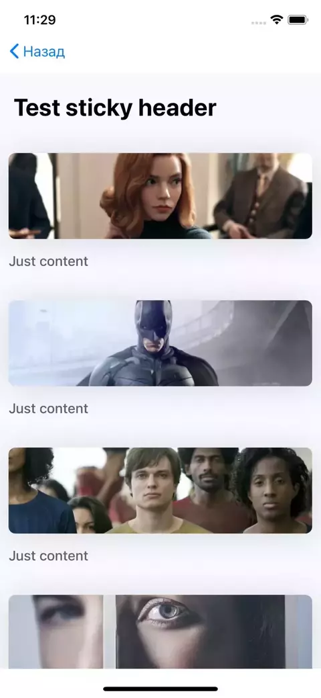

#Sticky header

This is the changed version of component: https://github.com/netguru/sticky-parallax-header
 
 ###About
 
This is the short version of `sticky-parallax-header` library. It's special for providing features of sticky header only.
You can use that component as for a sticky part of your project and as not sticky





Use the ContainerView like a wrapper:

```js
    <ContainerView
               screenTitle={"Test sticky header"}
               containerColor={"white"}
               isBackButton={true}
               navigation={this.props.navigation}
           >
               {[1, 2, 3, 4, 5,6,7].map((item) => {
                   return content(item);
               })}
    </ContainerView>
```
Props:
*  children
*  screenTitle,
*  onDataRefresh,
*  refreshing,
*  pending,
*  color
* containerColor
* isSticky
* isBackButton
* navigation
 ---
Tested on IOS platform while*
